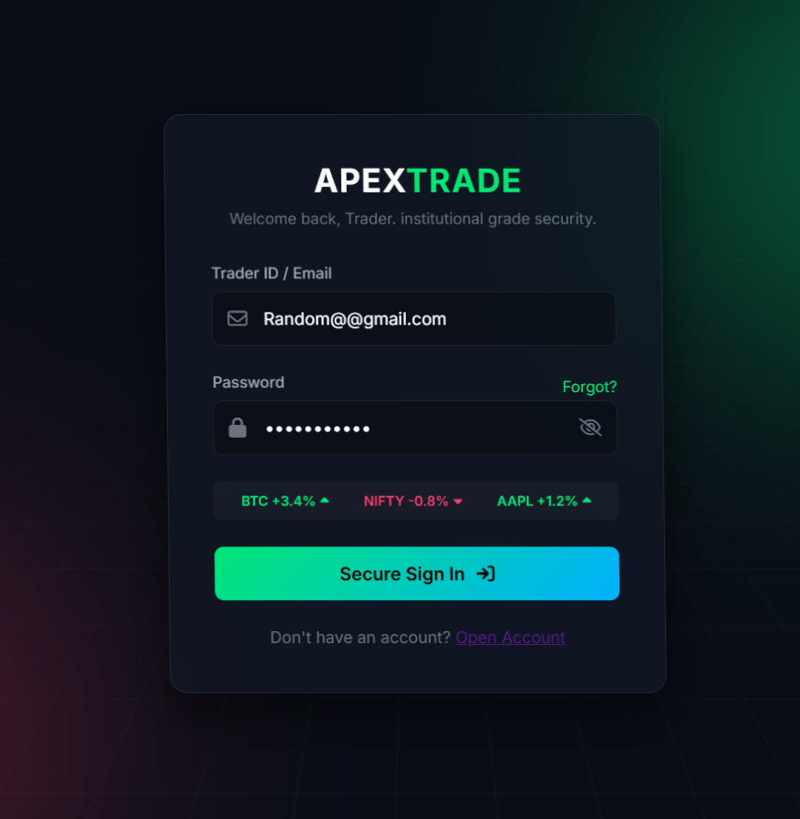
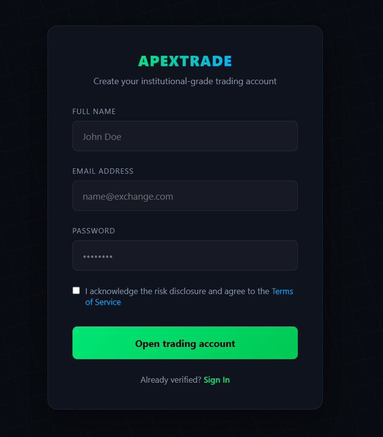
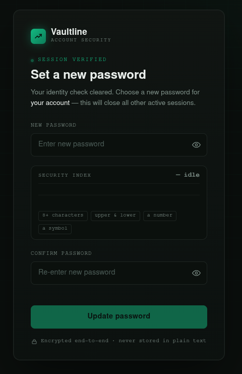
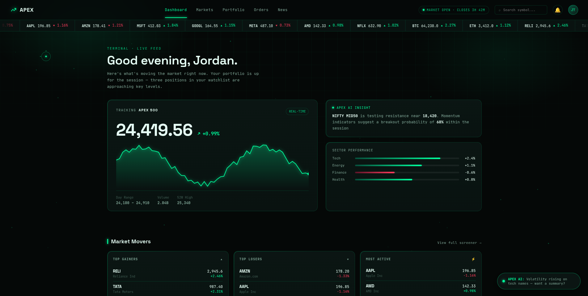
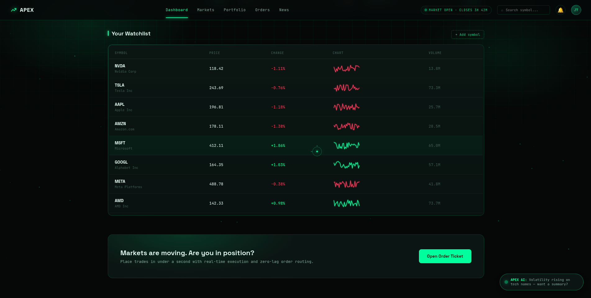

# TRIDENT

<div align="center">

### High-Performance Stock Exchange Platform Built with Modern C++

*A security-first stock exchange platform focused on performance, scalability, and clean backend architecture.*

---


</div>

---

# 📖 Overview

**Trident** is a full-stack stock exchange web application being developed from scratch using **Modern C++17**.

Unlike many web projects that rely on high-level frameworks, this project focuses on building a secure backend with C++, emphasizing low latency, modular architecture, and strong security practices.

The project is designed with long-term scalability in mind. While the current milestone focuses on **authentication and backend security**, future versions will expand into trading, portfolio management, real-time market data, analytics, and AI-assisted security.

The project is actively developed on **Arch Linux** using **CMake**, **Crow**, **MongoDB**, **Redis**, and several modern C++ libraries.

---

# 🚧 Development Status

The project is under active development.

Current implementation progress:

| Module                 | Progress          |
| ---------------------- | ----------------- |
| User Registration      | ✅ Complete        |
| Login System           | ✅ Complete        |
| Password Hashing       | ✅ Complete        |
| OTP Authentication     | ✅ Complete        |
| Redis Integration      | ✅ Complete        |
| Login Attempt Limiting | ✅ Complete        |
| JWT Generation         | ✅ Complete        |
| SQLite3 Integration    | ✅ Complete        |
| Logging System         | ✅ Complete        |
| Trading Engine         | 🚧 Planned        |
| Portfolio System       | 🚧 Planned        |
| Market Data            | 🚧 Planned        |
| AI Security Module     | 🔬 Research Phase |

---

# 🎯 Project Goals

This project is being developed with the following objectives:

* Build a production-inspired backend using Modern C++.
* Design authentication with multiple security layers.
* Learn scalable backend architecture.
* Gain hands-on experience with Redis and MongoDB.
* Implement secure authentication without relying on large frameworks.
* Build a strong portfolio project demonstrating systems programming concepts.

---

# ✨ Current Features

## 🔐 Authentication

* Secure user registration
* Existing-user validation before signup
* Secure login
* OTP-based verification
* JWT generation after successful verification
* Password hashing using Argon2id
* Secure password reset

---

## ⚡ Redis Integration

Redis is used for temporary security-related data.

Current implementation includes:

* OTP storage
* OTP expiration using TTL
* Login attempt counting
* Email blocking
* IP blocking

---

## 🛡 Security

Current security features include:

* Argon2id password hashing
* Libsodium cryptographic functions
* Redis-based login attempt limiting
* Email + IP blocking
* Temporary OTP sessions
* JWT-based authentication
* BSON document construction for MongoDB queries
* Input validation
* Secure authentication workflow

---

## 🗄 Database

MongoDB is used for persistent storage.

Current usage:

* User information
* Authentication data
* Login logs

---

## 📧 Email Service

The application uses **Brevo REST API** for:

* Sending OTP
* Email verification workflow

---

# 📸 Screenshots

## Landing Page

<p align="center">

</p>

---

## Login

<p align="center">

</p>

---

## Signup

<p align="center">

</p>

---

## OTP Verification

<p align="center">

</p>

## Forget Page 

<p align="centre">

</p>

## Front Page

<p align="centre">


</p>

---

# 🏗 Technology Stack

| Category         | Technology                |
| ---------------- | ------------------------- |
| Language         | C++17                     |
| Operating System | Arch Linux                |
| Build System     | CMake                     |
| Web Framework    | Crow                      |
| Database         | MongoDB                   |
| Cache            | Redis                     |
| Logs             | SQLite3                   |
| JWT              | jwt-cpp                   |
| Password Hashing | Argon2id (Libsodium)      |
| Email Service    | Brevo REST API            |
| HTTP Client      | libcurl                   |
| Networking       | Asio                      |
| Cryptography     | OpenSSL                   |
| Redis Client     | redis-plus-plus + hiredis |

---

# 📦 Major Dependencies

The project currently depends on the following libraries.

* Crow
* MongoDB C Driver
* libbson
* jwt-cpp
* redis-plus-plus
* hiredis
* OpenSSL
* Libsodium
* libcurl
* zlib
* Snappy
* Zstandard

---

# 💡 Design Philosophy

The backend is designed around several engineering principles.

## Security First

Every authentication request is validated before access is granted.

Passwords are never stored in plaintext.

OTP sessions expire automatically.

Login abuse is mitigated through Redis-based attempt limiting.

Password reset through redis.

---

## Modular Design

Each component has a dedicated responsibility.

Examples include:

* Authentication
* Redis
* Database
* JWT
* Cryptography
* Environment Configuration
* Logging
* Route Management
* SQLite

This separation keeps the codebase maintainable as new features are added.

---

## Performance

The project leverages C++ for:

* Low memory overhead
* Fast execution
* Efficient networking
* Better control over resources

---

## Scalability

The architecture is intentionally modular so future modules such as:

* Trading Engine
* Portfolio
* Market Data
* Order Matching
* AI Security

can be added without major refactoring.

---

# 🔐 Authentication Architecture

Authentication follows multiple verification stages instead of relying only on username and password.

```text
                User

                  │

                  ▼

        Check Existing User

                  │

                  ▼

      Verify Credentials (MongoDB)
                  
                  │

                  ▼

      Logs save in MongDB asynchronasally

                  │

                  ▼

         Generate OTP Session

                  │

                  ▼

      Store OTP inside Redis (TTL)

                  │

                  ▼

      Send OTP using Brevo API

                  │

                  ▼

         User Enters OTP

                  │

                  ▼

        Verify Redis Session

                  │

                  ▼

           Delete OTP

                  │

                  ▼

            Generate JWT

                  │

                  ▼

       Authentication Complete
```

Only after successful OTP verification is a JWT generated.

---

# 📝 Signup Flow

```text
User Registration

        │

        ▼

Validate Input

        │

        ▼

Check Existing User

        │

 ┌──────┴────────┐

 │               │

Exists        Doesn't Exist

 │               │

 ▼               ▼

Return Error   Hash Password

                   │

                   ▼

            Store in MongoDB

                   │

                   ▼

           Registration Success
```

---

# 🔑 Login Flow

```text
User Login

      │

      ▼

Attempt Limiter

      │

      ▼

Email Block Check

      │

      ▼

IP Block Check

      │

      ▼

Credential Verification

      │

 ┌────┴─────┐

 │          │

Fail      Success

 │          │

 ▼          ▼

Increase    Generate OTP

Attempts       │

 │             ▼

 ▼        Store in Redis

               │

               ▼

         Send via Brevo

               │

               ▼

          Verify OTP

               │

               ▼

          Generate JWT
```

---

# 🚫 Login Attempt Limiting

The backend includes a Redis-based protection layer against brute-force attacks.

Current workflow:

```text
Login Request

      │

      ▼

Blocked Email?

      │

      ▼

Blocked IP?

      │

      ▼

Verify Credentials

      │

 ┌────┴────┐

 │         │

Success   Failure

 │         │

 ▼         ▼

Reset     Increment Counter

               │

               ▼

        Maximum Attempts?

               │

               ▼

     Block Email + IP (TTL)
```

This mechanism significantly reduces repeated unauthorized login attempts while automatically restoring access after the configured timeout expires.

---

# 📌 Current Authentication Modules

* User Registration
* User Login
* OTP Generation
* OTP Verification
* Redis Session Handling
* JWT Generation
* Password Hashing
* Login Attempt Limiting
* Logging
* MongoDB Integration
* Logs storage

---

# 🏛 Project Architecture

The application follows a modular architecture where every major component has a dedicated responsibility.

```text
                            Frontend
                     (HTML • CSS • JavaScript)
                                   │
                                   │ HTTP
                                   ▼
                        ┌─────────────────────┐
                        │    Crow Web Server  │
                        └─────────────────────┘
                                   │
        ┌──────────────┬────────────┼─────────────┬──────────────┬─────────┐
        ▼              ▼            ▼             ▼              ▼         ▼
 Authentication      JWT         Redis        MongoDB        Logging     SQLite
        │              │            │             │              │         │
        └──────────────┴────────────┴─────────────┴──────────────┴─────────┘
                                   │
                            Business Logic
```

The backend is intentionally divided into independent modules so future components such as trading, portfolio management, and real-time market data can be integrated without major architectural changes!

---

# 📂 Project Structure

```text
.
├── Backend
│   ├── External
│   │   ├── Crow
│   │   └── jwt-cpp
│   │
│   ├── Headers
│   │   ├── AuditLogger.h
│   │   ├── AuditLogs.h
│   │   ├── crypto_utils.h
│   │   ├── database.h
│   │   ├── env_config.h
│   │   ├── JWT_token.h
│   │   ├── Logger.h
│   │   ├── LogQueue.h
│   │   ├── Paths.h
│   │   ├── Redis.h
│   │   ├── routes.h
│   │   ├── SQLite.h
│   │   └── Tables.h
│   │
│   ├── MongoDB
│   │   ├── forget_auth.cpp
│   │   ├── login_auth.cpp
│   │   ├── Logs_auth.cpp
│   │   └── signup_auth.cpp
│   │
│   ├── Redis
│   │   ├── AttemptManager.cpp
│   │   ├── OTP.cpp
│   │   ├── Redis_Start.cpp
│   │   └── Reset_Pass.cpp
│   │
│   ├── Routes
│   │   ├── Protected
│   │   │   └── Front_Route.cpp
│   │   │
│   │   ├── Public
│   │   │   ├── Forget_Route.cpp
│   │   │   ├── Home_Route.cpp
│   │   │   ├── Login_Route.cpp
│   │   │   ├── OTP_Route.cpp
│   │   │   └── Signup_Route.cpp
│   │
│   ├── Scripts
│   │   ├── build.sh
│   │   └── run.sh
│   │
│   ├── SQLite
│   │   ├── Data
│   │   │   └── audit_logs.db
│   │   │
│   │   ├── SQLite_data
│   │   │   └── SQLite.db
│   │   │
│   │   ├── AuditLogger.cpp
│   │   ├── AuditLogs.cpp
│   │   ├── LogQueue.cpp
│   │   ├── SQLite.cpp
│   │   └── Tables.cpp
│   │   
│   ├── src
│   │   ├── crypto_utils.cpp
│   │   ├── database.cpp
│   │   ├── env_config.cpp
│   │   ├── JWT_token.cpp
│   │   ├── login.cpp
│   │   ├── otp.cpp
│   │   ├── Routes_Manager.cpp
│   │   └── signup.cpp
│   │
│   ├── build
│   ├── main.cpp
│   └── CMakeLists.txt
│   └── .env.example
│   └── .env
│
├── Frontend
│   ├── HTML
│   ├── CSS
│   ├── Script
│   └── assets
│
├── README.md
└── .gitignore

```

---

# 📁 Directory Overview

## Backend/

Contains the complete backend implementation.

Responsibilities include:

* Authentication
* JWT generation
* OTP management
* Redis communication
* MongoDB interaction
* SQLite insertion
* Logging
* Route registration
* Asynchronous Logs saving 

---

## Headers/

Contains declarations for all major backend components.

Current modules include:

* Database
* JWT
* Redis
* Cryptography
* Logger
* Environment Configuration
* Route Definitions
* SQLite

---

## Redis/

Required for dynamic data storage for an particular time period

Current module include:

* Attempt limiting
* OTP verification and insertion
* Redis server setup
* Password reset feature

---

## SQLite/
 
Used to save an second copy of Logs to prevent loss of Data(Currently Logs only)

Current module contains:

Copy of Data on local disk
AuditLogs
Persistent queue
SQLite initialization
Tables for sqlite

---

## src/

Contains implementation of all backend modules.

Examples:

* Signup
* Login
* OTP
* JWT
* MongoDB
* Environment Loader
* Routes
* Forget password

## External/

Contains required repo 

### Crow/

Contains files required for web service

### jwt-cpp/

Required for JWT token generation for protected route access

---

## MongoDB/

Responsible for authentication-related database operations.

Current responsibilities include:

* Signup validation
* Login verification
* Log insertion
* Forget password verification and insertion

---

## Routes/

HTTP endpoint registration.

Current separation:

### Public Routes

Accessible without authentication.

Examples:

* Signup
* Login
* OTP
* Home
* Forget

### Protected Routes

Reserved for authenticated endpoints.

* Front

---

## Scripts/

Automation scripts for development.

Current scripts include:

### build.sh

Automates the project build process.

### run.sh

Starts the backend server after performing development setup tasks.

---

## Frontend/

Contains the complete client-side application.

Includes:

* HTML
* CSS
* JavaScript
* Static assets

---

# 🔐 Authentication Components

The authentication system is divided into multiple independent layers.

| Module  | Responsibility         |
| ------- | ---------------------- |
| Signup  | Register new users     |
| Login   | Verify credentials     |
| Redis   | OTP & attempt limiting |
| JWT     | Token generation       |
| MongoDB | Persistent storage     |
| Logger  | Authentication logs    |

---

# 🗄 MongoDB Design

MongoDB stores persistent information.

Current collections include:

## Users

Stores user account information.

Typical fields:

* Name
* Email
* Password Hash
* Account Creation Time

---

## Logs

Stores authentication events.

Examples:

* Login Success
* Login Failure
* Invalid Password
* Missing Details
* Database Errors
* Server Errors

This collection helps during debugging and future audit functionality.

---

# ⚡ Redis Design

Redis is used only for temporary data.

No permanent user information is stored inside Redis.

---

## OTP Storage

Stores generated OTPs.

Example key:

```text
otp:user@example.com
```

Purpose:

* Temporary verification
* Automatic expiration

---

## Login Attempts

Tracks failed login attempts.

Example:

```text
email_key:user@example.com
```

Used for:

* Brute-force prevention

---

## IP Tracking

Tracks failed login attempts from IP addresses.

Example:

```text
IP_key:192.168.1.10
```

Purpose:

* Prevent repeated attacks from the same IP.

---

## Blocked Email

```text
Blocked_email:user@example.com
```

Temporarily blocks authentication attempts.

---

## Blocked IP

```text
Blocked_IP:192.168.1.10
```

Temporarily blocks requests originating from the IP.

---

# 🔄 Authentication Data Flow

```text
Browser

   │

POST /login

   │

Crow Server

   │

Attempt Limiter

   │

MongoDB

   │

Credentials Valid

   │

Generate OTP

   │

Redis

   │

Brevo Email API

   │

User Receives OTP

   │

Verify OTP

   │

Redis Validation

   │

JWT Generation

   │

Authentication Success
```

---

# 🌐 API Documentation

## Authentication Endpoints

| Method | Endpoint    | Description                         |
| ------ | ----------- | ----------------------------------- |
| POST   | /api/signup | Register a new user                 |
| POST   | /api/forget | Reset the password                  |
| POST   | /api/login  | Verify credentials and generate OTP |
| POST   | /verify-otp | Verify OTP and generate JWT         |
| POST   |/api/Pass-reset | Verify OTP and generate JWT      |
| GET    | /signup     | SIGNUP page                         |
| GET    | /send-otp   | Send otp to users email             |
| GET    | /otp        | OTP page                            |
| GET    | /           | Landing page                        |
| GET    | /login      | Login Page                          |
| GET    | /logout     | Logout user                         |
| GET    | /forget     | FORGET page                         |
| GET    | /Pass-reset | Password Reset page                 |
| GET    | /Front-page | Front page                          |


---

# 📨 Example Authentication Flow

## Step 1

```http
POST /signup
```

Creates a new account after checking whether the user already exists.

---

## Step 2

```http
POST /login
```

Validates credentials.

If successful:

* OTP generated
* Redis session created
* Email sent through Brevo

---

## Step 3

```http
POST /verify-otp
```

Validates Redis OTP.

If verification succeeds:

* OTP removed
* JWT generated

---

# 🔑 Environment Variables

Create a `.env` file inside the **Backend** directory.

Example:

```env
MONGO_URI="YOUR MONGODB URI HERE"

SMTP_KEY="YOUR SMTP KEY HERE"

BREVO_REST_API="YOUR BREVO REST API KEY HERE"

EMAIL="SENDER EMAIL FOR NOTIFICATION,VERIFICATION,AUTHENTICATION etc."

JWT_SECRET="JWT SECRET KEY"

REDIS_URI="REDIS URI"
```

Do **NOT** commit your `.env` file.

---

# 📦 External Libraries

Current third-party libraries used by the project.

| Library          | Purpose                   |
| ---------------- | ------------------------- |
| Crow             | HTTP Framework            |
| jwt-cpp          | JWT implementation        |
| MongoDB C Driver | Database communication    |
| libbson          | BSON document creation    |
| redis-plus-plus  | Redis client              |
| hiredis          | Redis backend             |
| OpenSSL          | Cryptography              |
| Libsodium        | Argon2id password hashing |
| libcurl          | HTTP requests             |
| Asio             | Networking                |
| Snappy           | Compression dependency    |
| Zstandard        | Compression dependency    |
| zlib             | Compression dependency    |
| SQLite           | sqlite3                   |

---

# 🔍 Logging

The logging system currently records important authentication events.

Examples include:

* Successful Login
* Failed Login
* Invalid Password
* Missing Credentials
* Database Connection Failure
* Internal Server Error

These logs simplify debugging and will later support audit and monitoring features.

---

# 📈 Current Backend Responsibilities

The backend currently manages:

* User Registration
* Login Authentication
* Password Hashing
* OTP Generation
* OTP Verification
* Redis Session Management
* Login Attempt Limiting
* JWT Generation
* MongoDB Communication
* Logging
* Environment Configuration

---

# 🧩 Planned Backend Modules

The architecture has been designed to accommodate future modules without major restructuring.

Upcoming modules include:

* Trading Engine
* Portfolio Management
* Order Matching
* Market Data Integration
* Watchlist
* Transaction History
* Real-Time Notifications
* Performance Analytics
* AI-assisted Security
* Multi-threaded Data Processing

---

# 🚀 Getting Started

This guide explains how to build and run the project on **Arch Linux**.

> **Note**
>
> The project is actively developed and tested on  **Arch Linux**. While it may work on other Linux distributions, only Arch Linux is officially documented at the moment.

---

# 📋 Prerequisites

Before building the project, ensure the following tools are installed.

## Required Software

* Git
* GCC 16.1.1 (or newer)
* CMake
* Make
* OpenSSL
* Redis
* MongoDB
* Libsodium
* libcurl
* MongoDB C Driver
* redis-plus-plus
* hiredis
* YAY
* SQLite

---

# 📦 Installing Dependencies (Arch Linux)

Install the required packages using **pacman**.

> Package names may vary depending on repository updates.

```bash
sudo pacman -S git gcc cmake make openssl redis mongodb libsodium curl mongo-c-driver hiredis
```

If `redis-plus-plus` is not available in the official repositories, install it from the **AUR** or build it from source.

---

# 📥 Clone the Repository

```bash
git clone <https://github.com/prakhartrivedi9369-bot/Stock_Exchange_Website.git>

cd <Stock_Exchange_Website>
```

---

# ⚙️ Configure Environment Variables

Create the environment file.

```bash
cd Backend

cp .env.example .env
```

Open `.env` and configure the following values.

```env
MONGO_URI=

SMTP_KEY=

BREVO_REST_API=

EMAIL=

JWT_SECRET=

REDIS_URI=
```

---

# 🏗 Build the Project

Navigate to the backend.

```bash
cd Backend
```

Create the build directory.

```bash
mkdir build

cd build
```

Generate build files.

```bash
cmake ..
```

Compile the project.

```bash
cmake --build .
```

After a successful build, the executable will be available inside:

```text
Backend/build/
```

---

# ▶ Running the Project

Instead of manually starting everything, use the provided script.

Navigate to:

```text
Backend/Scripts/
```

Run:

```bash
./run.sh
```

This is the recommended way to start the backend during development.

---

# 📁 Build Script

The project also provides:

```text
build.sh
```

which can be used for automating the build process.

---

# 🛠 Development Workflow

Typical development cycle:

```text
Modify Code

      │

      ▼

Build Project

      │

      ▼

Run Backend

      │

      ▼

Test APIs

      │

      ▼

Check Logs

      │

      ▼

Repeat
```

---

# 🔍 Troubleshooting

## MongoDB Connection Error

Possible causes:

* MongoDB service is not running.
* Invalid `MONGO_URI`.
* Firewall restrictions.
* Incorrect credentials.

---

## Redis Connection Error

Verify that Redis is running.

Example:

```bash
redis-cli ping
```

Expected output:

```text
PONG
```

---

## Build Failure

Verify:

* GCC is installed.
* CMake version is compatible.
* Required development libraries are available.
* Build directory is clean.

A clean rebuild usually resolves stale CMake cache issues.

```bash
rm -rf build

mkdir build

cd build

cmake ..

cmake --build .
```

---

## JWT Errors

Common causes include:

* Missing `JWT_SECRET`
* Invalid secret
* Expired token
* Incorrect token formatting

---

## OTP Issues

Verify:

* Redis is running.
* Brevo API credentials are valid.
* SMTP configuration is correct.
* OTP has not expired.

---

# 🔒 Security Overview

Security is one of the primary goals of this project.

Current implementation includes:

* Argon2id password hashing
* Libsodium integration
* Redis-backed OTP storage
* Automatic OTP expiration
* Login attempt limiting
* Email blocking
* IP blocking
* JWT-based authentication
* MongoDB BSON construction
* Authentication logging

Additional security features will be added in future releases.

---

# 🗺 Roadmap

## Phase 1

* ✅ User Registration
* ✅ Login
* ✅ Password Hashing
* ✅ OTP Authentication
* ✅ Redis Integration
* ✅ Login Attempt Limiting
* ✅ JWT Generation
* ✅ Logging

---

## Phase 2

* Refresh Tokens
* Protected Route Middleware
* HttpOnly Cookie Support
* Authentication Verification Middleware
* Session Management

---

## Phase 3

* Trading Engine
* Order Placement
* Order Matching
* Portfolio Management
* Transaction History

---

## Phase 4

* Live Market Data
* Watchlists
* Real-Time Notifications
* Charts
* Analytics Dashboard

---

## Phase 5

* Deployment
* Docker Support
* CI/CD
* Production Configuration
* Performance Optimization

---

# 🔬 Research & Future Ideas

This project also serves as a platform for experimenting with advanced backend and security concepts.

Some long-term ideas include:

## AI-Assisted Security

An experimental local AI model dedicated exclusively to security analysis.

Possible responsibilities include:

* Suspicious request detection
* Login anomaly detection
* Traffic analysis
* Pattern recognition
* Threat classification

---

## Emergency Isolation Mode

A future experimental defense mechanism designed to isolate critical backend components if an unrecoverable attack is detected.

Instead of allowing potentially compromised requests to continue, the security layer would prioritize preserving data integrity by immediately isolating external access.

This concept is currently in the research phase.

---

## Multi-threaded Backend

Future versions aim to use multithreading for:

* Live market updates
* Concurrent order processing
* Background jobs
* Notification services
* Analytics generation

---

# 🤝 Contributing

Although this project is currently developed by a single contributor, suggestions, bug reports, and discussions are always welcome.

If you would like to contribute:

1. Fork the repository.
2. Create a new feature branch.
3. Commit your changes.
4. Push your branch.
5. Open a Pull Request.

Please open an issue before making major architectural changes.

---

# 📝 Coding Goals

This project emphasizes:

* Clean code
* Modular architecture
* Performance
* Scalability
* Security
* Maintainability

Every new feature should follow these principles.

---

# 📚 Learning Objectives

This project has been an opportunity to gain practical experience with:

* Modern C++
* Backend Development
* REST API Design
* Authentication Systems
* Redis
* MongoDB
* JWT
* Password Security
* Build Systems
* System Design
* Software Architecture
* SQLite database

---

# ⚠ Current Limitations

The project is still under active development.

Some planned features have not yet been implemented, including:

* Trading engine
* Portfolio management
* Refresh tokens
* Role-based authorization
* Production deployment
* Automated testing
* API documentation (OpenAPI/Swagger)

These will be introduced gradually as the project evolves.

---

# 📄 License

No open-source license has been selected yet.

Until a license is added, all rights remain reserved by the project author.

---

# ⭐ Support the Project

If you found this project useful or interesting:

* Star the repository
* Report bugs
* Suggest improvements
* Share feedback

Your support helps improve the project.

---

## 📬 Contact

Have questions or suggestions? Feel free to open an issue on this repository.

<div align="center">

**[prakhartrivedi9369-bot](https://github.com/prakhartrivedi9369-bot)**

</div>

<div align="center">

---

## Thank You for Visiting

**Built with Modern C++, Crow, MongoDB, Redis, and a passion for learning backend engineering.**

⭐ If you like the project, consider giving it a star.

</div>
